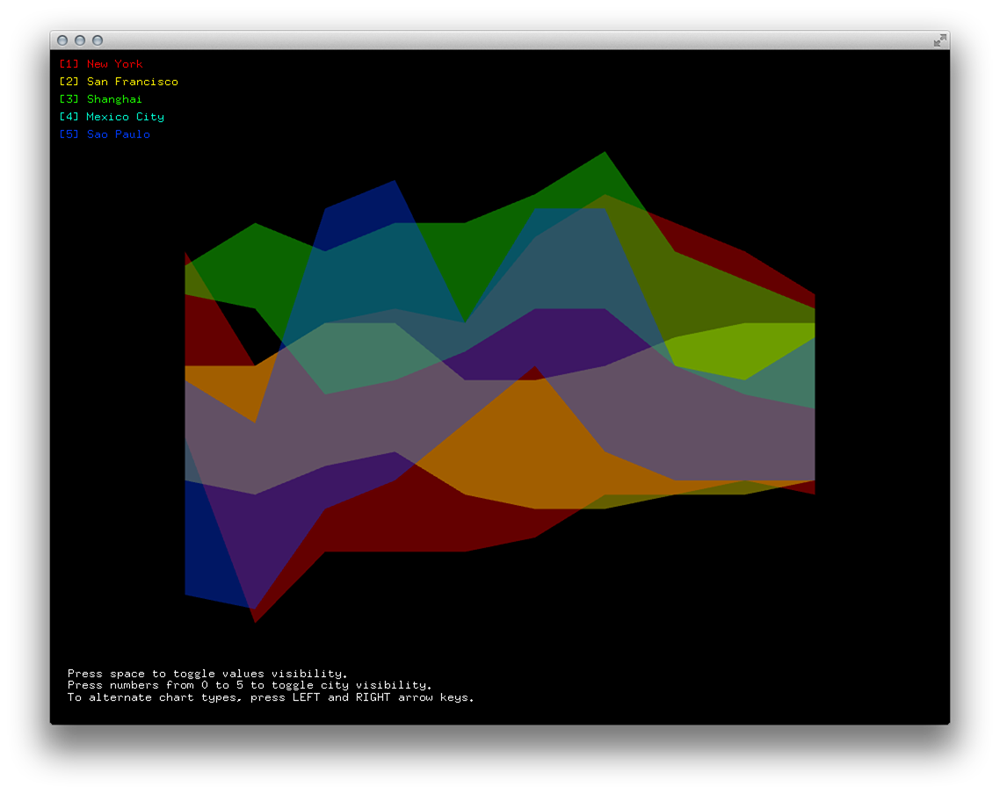
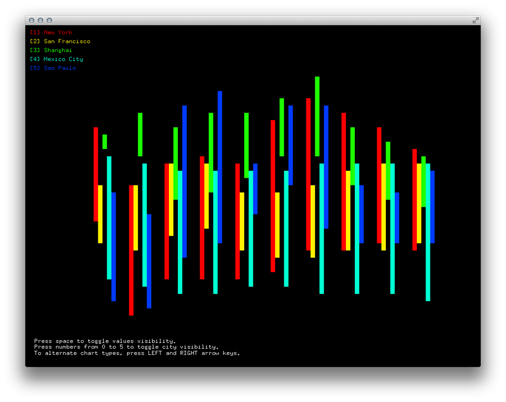

# [ofCourse] Lecture 11: Data Visualization

Examples for Lecture 1 of [ofCourse](http://www.ofcourse.io/): data visualization using [openFrameworks](http://openframeworks.cc/).

We are going to work with data from [Weather Underground](http://www.wunderground.com) in [JSON](http://json.org/) format.

[ofCourse](http://www.ofcourse.io/) is a creative coding program aimed at people with no coding skills. It provides a hands-on experience, tools, ideas, and full support for students to make their own projects.


---


## Setup

### Addons

These examples require [ofxJSON](https://github.com/jefftimesten/ofxJSON). Download and follow the installation instructions.


### Weather Underground API

* Setting up an account and API access:

	* Access the [Weather Underground API page](http://www.wunderground.com/weather/api/)
	* Create an account using **Sign Up for Free**.
	* Enter an email and password.  
	*Note: Please use a real email. A notification will be sent to your email address and you won't be able to access your account if you don't receive it.*
	* Confirm your account by email and log in.
	* Click on **Pricing** > **Purchase Key**
	* Fill out *all* the fields and confirm.
	* **Key ID** is the number we're gonna use to access the Weather Underground API. If you leave this page, you can come back by clicking on **Key Settings**.

* Requesting data

	* Take a look into the features on the **Documentation** page. The basic call is: **http://api.wunderground.com/api/*youApiKeyGoesHere*/conditions/q/CA/San_Francisco.json**
	* If you want to request info about an international location, replace the State with the country name. For example: **http://api.wunderground.com/api/*youApiKeyGoesHere*/conditions/q/*Brazil*/*Sao_Paulo*.json**  
	*Note: we are going to work with forecast.*


-----------


## Examples

To run the examples you need to comment out these lines on setup:  

```C++
    ofBuffer file = ofBufferFromFile("api_key.txt");  
    string apiKey = file;
```

And replace the apiKey variable with your own API key.


### Example 1: Acquire

Loading JSON data from the [Weather Underground API](http://www.wunderground.com/weather/api/) and displaying temperature for one city.


### Example 2: Parse/Filter

* Requesting data for different cities.
* Reading high and low temperatures.
* Storing data into City objects.


### Example 3: Represent

* Comparing temperatures using a line chart.


### Example 4: Interact/Refine

* Using an area chart.
* Adding visibility switch to cities.




### Example 5: Refine

* Experimenting with bar charts to represent amplitudes.

